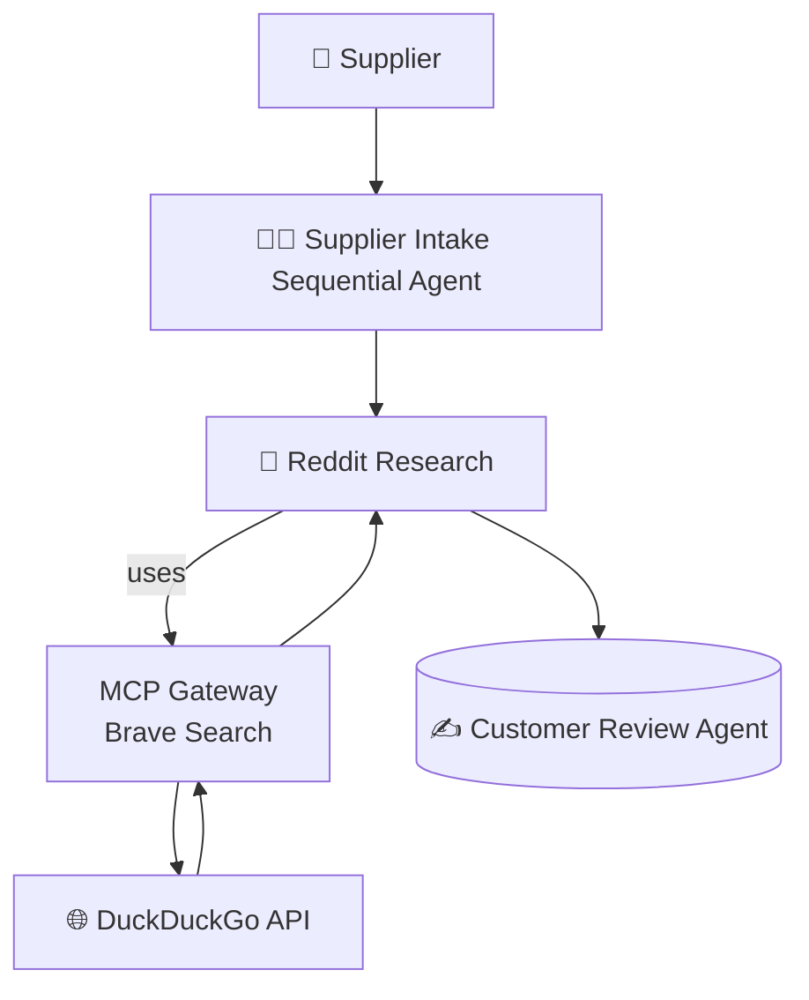

# 🛒 ADK Sock Store Agent

This demo shows how to use [Google ADK](https://google.github.io/adk-docs/) to build a
multi-agent sock vendor onboarding system. A supplier submits their product details via a
web portal; a pipeline of specialized agents then researches the vendor online (via Brave
Search), matches products against historical buyer data (via MongoDB), and automatically
adds approved items to the store catalog (via curl). The full system runs locally with
Docker Compose and Docker Model Runner.

# 🚀 Getting Started

### Requirements

+ **[Docker Desktop] 4.43.0+ or [Docker Engine]** installed.
+ **A laptop or workstation with a GPU** (e.g., a MacBook) for running open models locally. If you
  don't have a GPU, you can alternatively use **[Docker Offload]**.
+ If you're using [Docker Engine] on Linux or [Docker Desktop] on Windows, ensure that the
  [Docker Model Runner requirements] are met (specifically that GPU
  support is enabled) and the necessary drivers are installed.
+ If you're using Docker Engine on Linux, ensure you have [Docker Compose] 2.38.1 or later installed.

### Run the project

Some of the MCP servers used here require Secrets. Set the Brave and Reset api keys and then set the secrets for the gateway.

```sh
export BRAVE_API_KEY=<your_brave_api_key>
export RESEND_API_KEY=<resend_api_key>
export OPENAI_API_KEY=<openai_api_key>
make gateway-secrets
```

If you're running with an arm64 macos machine, then initialize the environment with one additional command:

```sh
DOCKER_DEFAULT_PLATFORM=linux/amd64 docker pull roberthouse224/catalogue
```

To start up the Sock Store and the Agent portal, run:

```sh
docker compose up --build
```

+ Open [*http://localhost:9090*](http://localhost:9090) to see the sock store.
+ Open [*http://localhost:3000*](http://localhost:3000) to see the Sock Vendor Agent Portal.

# ❓ What Can It Do?

Example input to the portal:

> “I am a sock vendor named Nike. Perhaps you've heard of us. We provide colorful compressions socks,
> that are elegant and affordable.  Our Nike compression socks are 12.99 each.  
> Here are some urls to images of the socks <https://tinyurl.com/5n6spnvu> and
> <https://tinyurl.com/mv8ebjnh>"

# 🔧 Architecture Overview



# 🤝 Agent Roles

| **Agent**   | **Tools Used**        | **Role Description**                                                         |
| ----------- | --------------------- | ---------------------------------------------------------------------------- |
| **Supplier Intake**  |  None                | Resesarches a new sock vendor and decides whether to onboard them to the store |
| **Reddit Research**  |  BraveSearch via MCP | Searches for reviews on the vendor                             |
| **Customer Review**  |  MongoDB via MCP     | Match styles against historical buyer data to see if it's a match for the store |
| **Catalog**          |  curl via MCP        | Adds the product sku to the catalog if we like the product |

# 🧹 Cleanup

To stop and remove containers and volumes:

```sh
docker compose down -v
```

# 📎 Credits

+ [ADK]
+ [Docker Compose]

[ADK]: https://google.github.io/adk-docs/
[Docker Compose]: https://github.com/docker/compose
[Docker Desktop]: https://www.docker.com/products/docker-desktop/
[Docker Engine]: https://docs.docker.com/engine/
[Docker Model Runner requirements]: https://docs.docker.com/ai/model-runner/
[Docker Offload]: https://www.docker.com/products/docker-offload/
