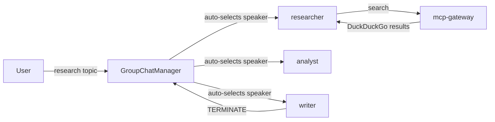

# AG2 Multi-Agent Research Team

A three-agent web research system built with [AG2](https://github.com/ag2ai/ag2) (formerly AutoGen),
Docker Model Runner, and the DuckDuckGo MCP tool. A Gradio browser interface streams each agent's
output as the conversation progresses.

Three agents collaborate under `GroupChat` with LLM-driven speaker selection:

- **researcher** — searches the web for information via MCP DuckDuckGo
- **analyst** — critiques findings, identifies gaps, requests follow-up searches
- **writer** — synthesises the final Markdown report and signals termination

The GroupChatManager determines which agent speaks next based on conversation context — no
hardcoded routing logic or keyword matching.

## Requirements

- [Docker Desktop](https://docs.docker.com/desktop/) 4.43.0+ or [Docker Engine](https://docs.docker.com/engine/) with Docker Compose 2.38.1+
- A machine with a GPU for running open models locally, or use [Docker Offload](https://docs.docker.com/offload/) for remote GPU inference

## Run locally (Docker Model Runner)

```sh
docker compose up --build
```

Open http://localhost:7860 in your browser.

## Run with Docker Offload

```sh
docker compose -f compose.yaml -f compose.offload.yaml up --build
```

Uses a 14B parameter model with larger context window.

## Run with OpenAI

Create a `secret.openai-api-key` file containing your API key:

```
sk-...
```

Then start with the OpenAI override:

```sh
docker compose -f compose.yaml -f compose.openai.yaml up --build
```

## How it works



The Gradio interface streams each agent's messages as they are generated,
making the multi-agent collaboration visible in real time.

## Project structure

| File | Purpose |
|---|---|
| `compose.yaml` | Defines the agent service and mcp-gateway sidecar |
| `compose.openai.yaml` | Override to use OpenAI instead of Docker Model Runner |
| `compose.offload.yaml` | Override to use a larger model via Docker Offload |
| `Dockerfile` | Builds the agent container |
| `pyproject.toml` | Python dependencies |
| `agent.py` | Agent definitions, GroupChat setup, Gradio interface |
| `tests/test_agent.py` | Unit tests for agent instantiation (no LLM calls) |

## AG2 concepts demonstrated

- `GroupChat` with `speaker_selection_method="auto"` — the manager LLM selects which agent
  speaks next based on conversation context, not hardcoded sequencing
- `create_toolkit` from `autogen.mcp` — wraps any MCP server's tools as AG2-native `Tool`
  objects, compatible with `register_for_llm` / `register_for_execution`
- `a_initiate_chat` — async-native GroupChat execution, compatible with Gradio's async
  streaming generator interface
- Gradio `ChatInterface` with an async generator — yields intermediate results as each
  agent's reply is added to `groupchat.messages`
